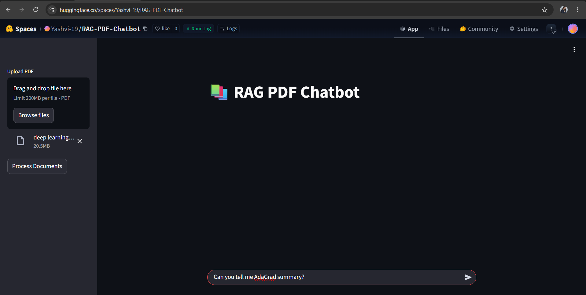
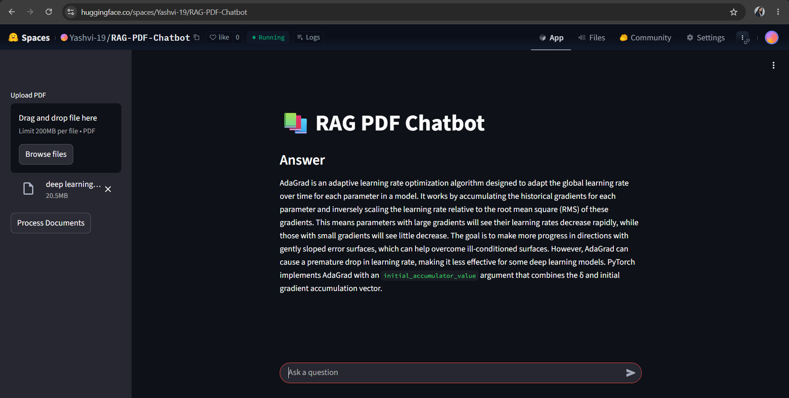

<div align="center">

# 📚 RAG PDF Chatbot

### Transform Any PDF into an Intelligent AI Knowledge Base


<br>

### 🚀 Live Demo

🔗 https://huggingface.co/spaces/Yashvi-19/RAG-PDF-Chatbot

---

### ✨ Built With

Python • LangChain • FAISS • Hugging Face Embeddings • Mistral AI • Streamlit

</div>

---

# 🌟 Overview

RAG PDF Chatbot is an AI-powered document intelligence system that allows users to upload PDF files and interact with them using natural language.

Instead of sending the entire PDF to an LLM every time, the system intelligently retrieves only the most relevant information using semantic search and Retrieval-Augmented Generation (RAG).

This approach delivers faster, more accurate, scalable, and context-aware responses.

---

# 🚀 Why This Project Is Different

Most people think:

> "ChatGPT can already read PDFs. Why build this?"

The answer is simple.

Traditional LLMs process PDFs as temporary context.

This project creates a dedicated AI-powered knowledge base.

### ❌ Traditional LLM Workflow

```text
Upload PDF
     ↓
Send Large Context
     ↓
LLM Generates Response
```

### ✅ RAG Workflow

```text
PDF Upload
     ↓
Text Chunking
     ↓
Embedding Generation
     ↓
FAISS Vector Database
     ↓
Semantic Search
     ↓
Relevant Context Retrieval
     ↓
Mistral AI
     ↓
Accurate Response
```

---

# 🎯 Key Benefits

### 🔍 Semantic Search

Finds information based on meaning instead of exact keywords.

### ⚡ Faster Responses

Only relevant content is sent to the LLM.

### 📚 Large PDF Support

Efficiently handles lengthy PDFs and research papers.

### 🎯 Reduced Hallucinations

Answers are grounded in document content.

### 💰 Cost Efficient

Consumes fewer tokens compared to sending complete documents.

### 🏢 Industry-Level Architecture

Uses the same RAG concepts used in modern AI assistants and enterprise knowledge systems.

---

# 🏗️ System Architecture

```text
                    PDF Document
                          │
                          ▼
                  PyPDFLoader
                          │
                          ▼
              Recursive Text Splitter
                          │
                          ▼
              Hugging Face Embeddings
                          │
                          ▼
                  FAISS Vector Store
                          │
                          ▼
                     Retriever
                          │
                          ▼
                    Mistral AI
                          │
                          ▼
                   Final Response
```

---

# ✨ Features

✅ PDF Upload Support

✅ AI-Powered Question Answering

✅ Retrieval Augmented Generation (RAG)

✅ FAISS Vector Database

✅ Semantic Search

✅ Hugging Face Embeddings

✅ Mistral AI Integration

✅ Context-Aware Responses

✅ Streamlit User Interface

✅ Hugging Face Deployment

---

# 🛠️ Tech Stack

| Technology | Purpose |
|------------|----------|
| Python | Backend Development |
| Streamlit | Interactive User Interface |
| LangChain | RAG Pipeline |
| FAISS | Vector Database |
| Hugging Face | Embedding Model |
| Mistral AI | Large Language Model |
| PyPDF | PDF Parsing |

---

# 📂 Project Structure

```text
RAG-PDF-Chatbot
│
├── app.py
├── requirements.txt
├── README.md
└── .gitattributes
```

---

# ⚙️ Installation

### Clone Repository

```bash
git clone https://github.com/yashvi-data-analyst/RAG-PDF-Chatbot.git
```

### Move Into Project Directory

```bash
cd RAG-PDF-Chatbot
```

### Install Dependencies

```bash
pip install -r requirements.txt
```

### Create Environment Variable

```env
MISTRAL_API_KEY=YOUR_API_KEY
```

### Run Application

```bash
streamlit run app.py
```

---

# 🌍 Live Deployment

### Hugging Face Space

🔗 https://huggingface.co/spaces/Yashvi-19/RAG-PDF-Chatbot

---

# 💡 Real-World Applications

📑 Research Paper Assistant

⚖️ Legal Document Q&A

🏢 Enterprise Knowledge Base

📚 Educational PDF Tutor

📊 Financial Report Analysis

🏥 Medical Document Search

📋 HR Policy Assistant

---


# 📸 Project Preview

### Home Interface



### PDF Question Answering



---

# 🎯 Future Enhancements

- Multi-PDF Support
- Chat History
- Source Citations
- Page References
- Conversation Memory
- Authentication System
- Cloud Database Integration

---

# 👩‍💻 Author

## Yashvi Verma

### AI & Machine Learning Enthusiast

### GitHub

https://github.com/yashvi-data-analyst

### LinkedIn

https://www.linkedin.com/in/yashvi-verma19/

---

<div align="center">

### ⭐ If you found this project useful, please consider giving it a Star!

### 🚀 Built with AI, RAG, and Curiosity

</div>
